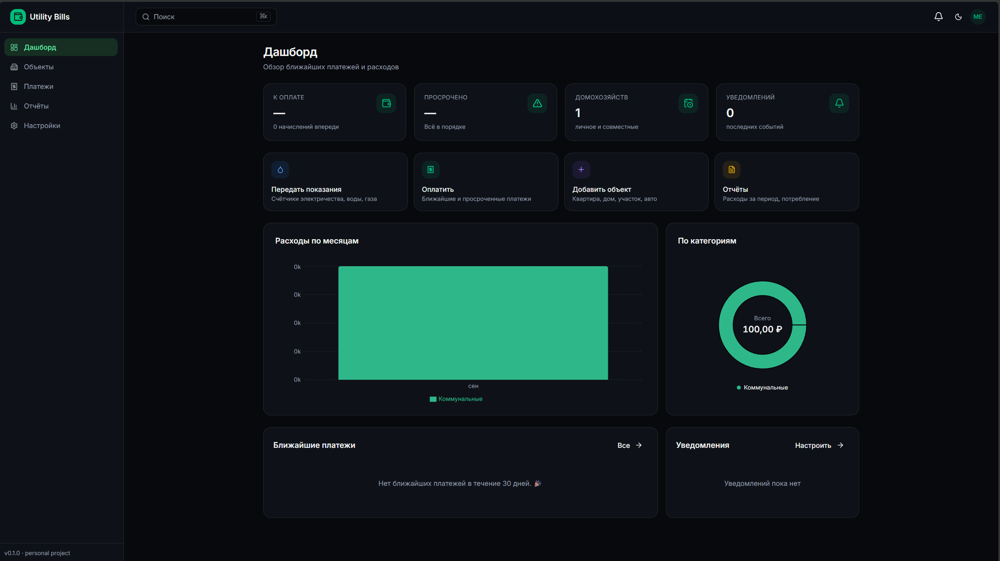
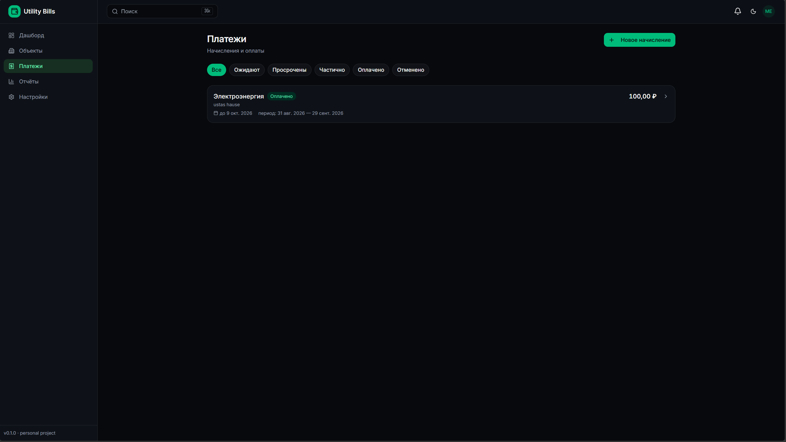
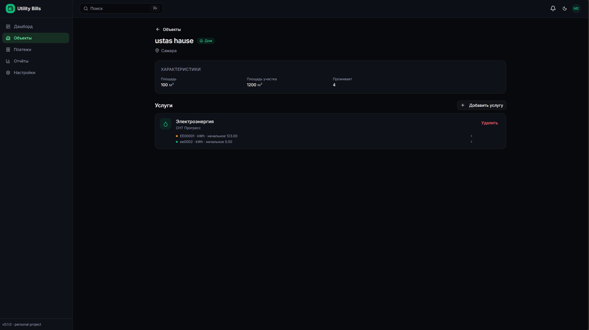
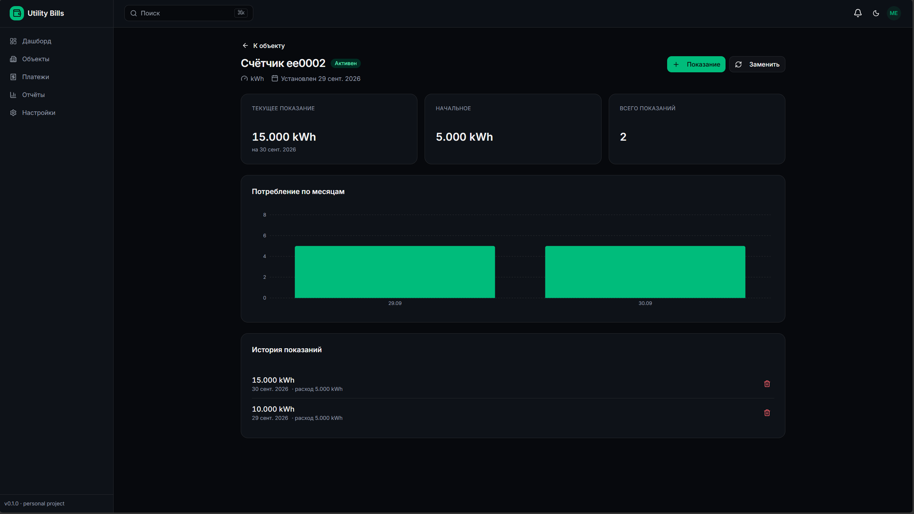
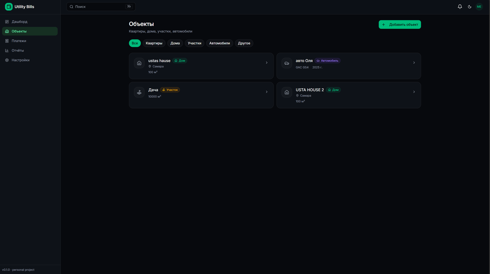
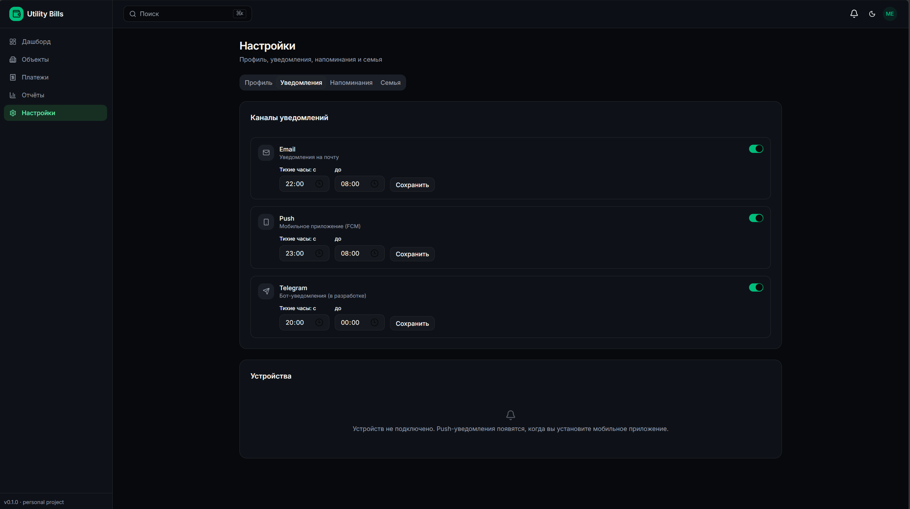

# Utility Bills

[](https://github.com/ustas1136/utility-bills/actions/workflows/ci.yml)
[](https://opensource.org/licenses/MIT)
[](https://www.python.org/)
[](https://nodejs.org/)
[](https://fastapi.tiangolo.com/)
[](https://react.dev/)

Личное веб-приложение для учёта коммунальных платежей, налогов, страховок и других регулярных расходов.

**Возможности:**

- 🏠 Объекты: квартиры, дома, участки, автомобили — с типизированными атрибутами (VIN, кадастр, площадь)
- 💡 Справочник услуг: электричество, вода, газ, налоги, ОСАГО и другие — расширяемый
- 📊 Показания счётчиков с историей, графиком потребления и заменой счётчика
- 💸 Начисления и платежи: ручные и автоматические (по показаниям × тариф), частичные оплаты
- 🔔 Напоминания: правила «за N дней», email-доставка, планировщик
- 👨‍👩‍👧 Семейный доступ: роли owner / admin / member / viewer, приглашения
- 📈 Отчёты: расходы по месяцам, категориям, объектам; экспорт CSV
- 🌓 Тёмная тема, адаптивная вёрстка, command palette (Ctrl+K)
- 🔐 JWT-аутентификация с refresh-токенами

## Скриншоты

<table>
  <tr>
    <td></td>
    <td></td>
  </tr>
  <tr>
    <td></td>
    <td></td>
  </tr>
  <tr>
    <td></td>
    <td></td>
  </tr>
</table>

## Стек

**Backend**

- Python 3.12 · FastAPI · SQLAlchemy 2.0 (async) · Alembic · PostgreSQL 16
- Аутентификация: JWT (access + refresh), argon2
- Планировщик: APScheduler + aiosmtplib
- Тесты: pytest, httpx.AsyncClient — 93 теста
- Линтер: ruff + mypy

**Frontend**

- React 19 · TypeScript · Vite 8
- Tailwind CSS v4 · shadcn/ui (Radix)
- TanStack Query · React Hook Form · Zod · Zustand
- Recharts · date-fns · lucide-react
- Роутинг: React Router v7 с lazy-loading

**Инфраструктура**

- Docker Compose (dev + prod)
- GitHub Actions: линтер, тесты с PostgreSQL-сервисом, сборка образов
- Code splitting: начальный бандл 8 kB gzip, vendor-чанки

## Быстрый старт

### Требования

- Docker Desktop (Windows / macOS / Linux)
- WSL 2 (на Windows) — рекомендуется для скорости

### Запуск

```bash
git clone git@github.com:ustas1136/utility-bills.git
cd utility-bills

# Скопируйте .env и сгенерируйте секрет
cp backend/.env.example backend/.env
openssl rand -hex 32
# Вставьте полученное значение в JWT_SECRET в backend/.env

# Запустить всё
docker compose up --build
```

Сервисы:

| Сервис | URL |
|---|---|
| Backend API | http://localhost:18090 |
| Swagger UI | http://localhost:18090/docs |
| Frontend | http://localhost:18092 (prod) или http://localhost:5173 (dev) |
| PostgreSQL | `localhost:15440` (порт хоста) |

### Разработка

Backend:

```bash
cd backend
python3.12 -m venv .venv && source .venv/bin/activate
pip install -e ".[dev]"
docker compose up -d db        # только БД
uvicorn app.main:app --reload  # запустить на хосте
```

Frontend:

```bash
cd frontend
npm install
npm run dev                    # Vite с прокси на backend
```

### Тесты и линтеры

```bash
# Backend
cd backend
ruff check .
pytest -v                       # 93 теста

# Frontend
cd frontend
npm run lint                    # tsc --noEmit
npm run build
```

## Архитектура

```
utility-bills/
├── backend/
│   ├── app/
│   │   ├── api/              # FastAPI routers
│   │   ├── core/             # config, security, permissions
│   │   ├── db/               # Base, session, migrations
│   │   ├── models/           # SQLAlchemy 2.0
│   │   ├── repositories/     # доступ к БД
│   │   ├── services/         # бизнес-логика
│   │   ├── schemas/          # Pydantic v2
│   │   └── workers/          # APScheduler, задачи
│   └── tests/
├── frontend/
│   └── src/
│       ├── api/              # fetch-клиент, типы
│       ├── components/       # UI, shadcn
│       ├── hooks/            # use-auth, use-theme, hotkeys
│       ├── pages/            # страницы (lazy)
│       ├── store/            # zustand
│       └── lib/              # utils, format, charts
└── docker-compose.yml
```

**Слои backend:**

```
api  →  services  →  repositories  →  models
```

- `api` — только HTTP-слой, валидация, аутентификация.
- `services` — бизнес-логика, транзакции.
- `repositories` — только SQL-запросы.
- `models` — SQLAlchemy-схема.

**Схема БД:** 17 таблиц — `users`, `households`, `household_members`, `invitations`, `service_types`, `tariffs`, `properties`, `property_services`, `meters`, `readings`, `charges`, `payments`, `reminder_rules`, `notification_preferences`, `notifications`, `devices`, `alembic_version`.

## Скрипты

| Команда | Что делает |
|---|---|
| `make dev` | Запустить backend + frontend + db в фоне |
| `make test` | Прогнать тесты backend |
| `make lint` | Линтеры backend + frontend |
| `make migrate` | Применить миграции Alembic |
| `make migrate-new m="..."` | Сгенерировать миграцию |
| `make down` | Остановить всё |

## CI

На каждый push в `main` / `develop` и в PR:

- **Lint backend** — ruff + mypy
- **Test backend** — pytest на PostgreSQL-сервисе (93 теста)
- **Lint frontend** — TypeScript
- **Build frontend** — production-сборка Vite
- **Docker build backend / frontend** — образы с cache

## Roadmap

- [x] Backend: auth, households, catalog, properties, meters, charges, reminders, reports
- [x] Frontend: дашборд, объекты, платежи, счётчики, настройки, семья
- [x] JWT с refresh, роли, приглашения
- [x] Планировщик напоминаний + email
- [x] Command palette (Ctrl+K), code splitting
- [ ] Мобильное приложение (React Native / Flutter)
- [ ] Push-уведомления (FCM)
- [ ] Интеграции: Госуслуги, ФНС, банки
- [ ] Прикрепление файлов (квитанции, чеки)
- [ ] Мультивалютные отчёты с курсами ЦБ

## Лицензия

MIT. См. [LICENSE](LICENSE).

## Автор

[ustas1136](https://github.com/ustas1136)